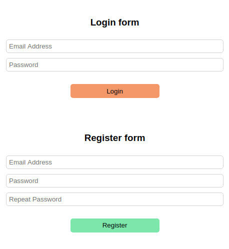

# Basic Auth example for FastApi (Backend) + VanillaJS (Frontend)
- `pip3 install requirements`
- `python3 main.py`
- open `http://0.0.0.0:8888/static` in your browser
- you can try register, login and logout. All data stored in `fake_users_db` dictionary

